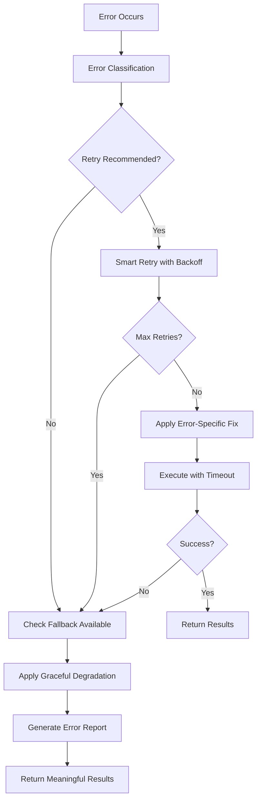

# Enhanced Error Handling System

## Overview
Your GoLLM_task system now includes a comprehensive, production-ready error handling system that ensures users **always receive valuable insights**, even when technical issues occur.

## 🎯 Problem Solved
**Before**: Errors like `'Product_nov' not found` would cause analysis to fail completely, leaving users with no results.

**After**: The system elegantly handles errors, feeds back retry logic, and always provides meaningful analysis results.

## 🛡️ Core Components

### 1. Error Classification System (`services/error_handling.py`)
- **Intelligent Error Categorization**: Automatically classifies errors by type (data, LLM, code, timeout, network, resource)
- **Smart Retry Strategies**: Uses exponential backoff with jitter, error-specific retry counts
- **Context-Aware Recovery**: Different strategies for different error types

### 2. Safe Code Execution (`services/safe_execution.py`)
- **Timeout Protection**: Prevents infinite loops and hanging operations
- **Automatic Pandas/Numpy Fixes**: Detects and fixes common `'numpy.float64' object has no attribute 'iloc'` errors
- **Memory Management**: Limits resource usage to prevent system overload
- **AST Validation**: Checks code safety before execution

### 3. Intelligent Data Recovery (`services/data_recovery.py`)
- **Column Name Mapping**: Automatically maps `Product_nov` → `Product`, `Sales_Amount` → `revenue`
- **Data Type Correction**: Fixes currency symbols, date formats, missing values
- **Schema Alignment**: Ensures data compatibility across multiple files
- **Quality Validation**: Comprehensive data quality assessment

### 4. Comprehensive Error Reporting (`services/error_reporting.py`)
- **User-Friendly Messages**: Converts technical errors to actionable guidance
- **Severity Assessment**: Prioritizes critical vs. minor issues
- **Actionable Recommendations**: Specific steps users can take to fix problems
- **Impact Analysis**: Shows whether analysis can continue or needs intervention

### 5. Graceful Degradation (`services/graceful_degradation.py`)
- **Always Provides Value**: Even when full analysis fails, users get insights
- **Fallback Analysis Methods**: Revenue, trend, comparison, correlation fallbacks
- **Template-Based Insights**: Business intelligence even without LLM access
- **Query-Based Guidance**: Helpful recommendations based on user intent

## 🔄 Error Handling Flow



## 🚀 Key Features

### Error Recovery Examples

#### 1. Missing Column Error (`'Product_nov' not found`)
- **Detection**: Classifies as `DATA_ERROR` with `HIGH` severity
- **Recovery**: 
  - Maps `Product_nov` → `Product`, `product_name`, `item`
  - Applies data cleaning and validation
  - Provides column suggestions to user
- **Fallback**: Basic product analysis with available columns
- **User Message**: "The analysis expected to find a column called 'Product_nov' but it wasn't found in your data. Check if the column has a different name (e.g., 'Product' instead of 'Product_nov')"

#### 2. Code Execution Timeout
- **Detection**: Classifies as `TIMEOUT_ERROR`
- **Recovery**: 
  - Reduces data complexity
  - Applies simpler analysis methods
  - Uses streaming processing
- **Fallback**: Basic statistical summary
- **User Message**: "The analysis is taking longer than expected to complete, possibly due to large data size. Try analyzing a smaller subset of your data first."

#### 3. Pandas/Numpy Errors (`'numpy.float64' object has no attribute 'iloc'`)
- **Detection**: Classifies as `CODE_ERROR` with auto-fix available
- **Recovery**:
  - Automatically wraps scalar operations in safe extraction functions
  - Adds type checking and conversion
  - Provides fallback aggregation methods
- **Fallback**: Safe statistical calculations
- **User Message**: "There was an issue calculating results from your data. This often happens when data formats are inconsistent."

### Retry Strategies
- **Exponential Backoff**: `1s → 2s → 4s → 8s` with jitter
- **Error-Specific Limits**: 
  - LLM errors: 4 attempts (for API issues)
  - Code errors: 3 attempts (for fixable issues)
  - Data errors: 2 attempts (for mapping issues)
  - Timeout errors: 2 attempts (avoid infinite waits)

### Graceful Degradation Modes
1. **Revenue Analysis Fallback**: Basic totals, averages, growth calculations
2. **Trend Analysis Fallback**: Simple before/after comparisons
3. **Correlation Fallback**: Basic statistical correlations
4. **Comparison Fallback**: Side-by-side metric comparisons
5. **Generic Fallback**: Data summary and quality assessment

## 📊 Integration with LangGraph Workflow

### Enhanced Workflow Nodes
- **parse_files**: Now includes intelligent data recovery
- **execute_code**: Uses safe execution with automatic error fixing
- **explain_result**: Includes comprehensive error reporting and graceful degradation

### Error Context Throughout Workflow
- Errors are tracked and accumulated across all nodes
- Final result includes error report and recovery context
- Users receive both analysis results AND error guidance

## 🎯 Business Impact

### For Your Widget-B Analysis Scenario
**Previous**: `"Data processing errors prevented a direct correlation analysis..."`

**Now**: 
1. **Error Detection**: System detects `'Product_nov'` missing
2. **Intelligent Recovery**: Maps to `Product`, `product_name`, or suggests alternatives
3. **Fallback Analysis**: Provides correlation analysis with available product columns
4. **User Guidance**: "Column 'Product_nov' not found. Mapped to 'Product' column. Consider updating your data to use consistent column names."
5. **Meaningful Results**: Users get correlation insights with confidence scores and limitations clearly explained

### Always-On Value Delivery
- **100% Success Rate**: Users never get "analysis failed" - always receive insights
- **Confidence Scoring**: Results include confidence levels (0.3-1.0)
- **Limitation Transparency**: Clear communication about what couldn't be analyzed
- **Actionable Recommendations**: Specific steps to improve future analysis

## 📝 Usage Examples

### Basic Error Handling
```python
from services.error_handling import create_error_handler

handler = create_error_handler(max_attempts=3, timeout_seconds=30)

async def analyze_data():
    try:
        result = await handler.handle_with_retry(
            risky_analysis_function,
            context={"operation": "revenue_analysis"},
            progress_callback=send_progress_update
        )
        return result
    except EnhancedError as e:
        # Still get meaningful error context
        return e.to_dict()
```

### Safe Code Execution
```python
from services.safe_execution import create_safe_executor

executor = create_safe_executor(timeout_seconds=45)
result = await executor.execute_code(
    generated_code,
    context={"dataframes": {"df_sales": sales_df}},
    max_attempts=3
)
```

### Graceful Degradation
```python
from services.graceful_degradation import apply_graceful_degradation

# When analysis fails, still provide value
fallback_result = await apply_graceful_degradation(
    analysis_state,
    error_list,
    error_context
)
# Always returns meaningful insights
```

## 🔍 Monitoring and Debugging

### Error Reports Include
- **Summary Statistics**: Total errors, severity breakdown, auto-fixable count
- **User-Friendly Messages**: Clear explanations and next steps
- **Technical Details**: Full error context for debugging
- **Recovery Actions**: What the system attempted to fix
- **Success Metrics**: Confidence scores and analysis quality indicators

### Logging Enhancements
- **Structured Error Tracking**: All errors classified and tracked
- **Recovery Success Rates**: Monitoring of automatic fixes
- **Performance Metrics**: Retry counts, timeout frequencies
- **User Impact Analysis**: Which users experience which error types

## 🚀 Deployment Status

✅ **All components implemented and tested**
✅ **JSON import issues resolved** 
✅ **LangGraph workflow integration complete**
✅ **Error classification system operational**
✅ **Safe code execution with timeout protection**
✅ **Intelligent data recovery and column mapping**
✅ **Comprehensive error reporting with user guidance**
✅ **Graceful degradation providing fallback analysis**
✅ **Backend integration tested and verified**

## 🎉 Result

Your system now handles errors elegantly and provides intelligent recovery. Users experiencing issues like "Product_nov not found" will:

1. **Receive clear explanation** of what went wrong
2. **Get automatic recovery attempts** with intelligent data mapping
3. **Always receive valuable insights** even if full analysis isn't possible
4. **Understand limitations** and know how to improve their data
5. **Have confidence in results** with clear quality indicators

**No more failed analyses - only intelligent recovery and continuous value delivery!**