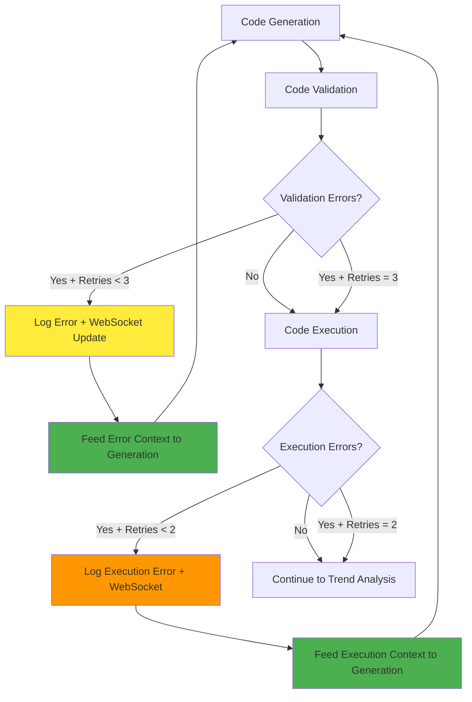

# Error-Aware Retry System with WebSocket Integration

## Overview
Your GoLLM_task system now includes an intelligent retry mechanism that feeds error information back to the code generation step, creating a learning loop that improves with each attempt.

## 🎯 Key Features

### 1. Smart Retry Logic
- **Max 3 retries for code generation** with error context feedback
- **Max 2 retries for code execution** (loops back to generation)
- **Intelligent error classification** determines if retry is worthwhile
- **Error context preservation** across retry attempts

### 2. WebSocket Integration
- **Real-time retry notifications** sent to connected clients
- **Detailed error context** shared with frontend
- **Progress updates** with retry attempt numbers
- **Error logging** with comprehensive context

### 3. Error Context Feedback Loop
- **Previous errors inform new generation attempts**
- **Specific guidance** based on error types (KeyError, pandas issues, etc.)
- **Progressive code simplification** on subsequent retries
- **Learning from execution failures**

## 🔄 Retry Flow Diagram



## 📋 Implementation Details

### Retry Decision Functions

```python
def should_retry_with_error_context(state: AnalysisState) -> str:
    """Decide whether to retry code generation with error context"""
    retry_count = state.get("generation_retry_count", 0)
    errors = state.get("errors", [])
    
    # Check specific error types that warrant retry
    if errors and retry_count < 3:
        error_text = " ".join(errors[-5:]).lower()
        if any(keyword in error_text for keyword in [
            'column', 'keyerror', 'not found', 'missing', 
            'attribute', 'syntax', 'pandas', 'numpy'
        ]):
            return "retry_generation"
    
    return "proceed"
```

### Error Context Integration

When retrying, the system:
1. **Analyzes recent errors** (last 5 errors)
2. **Identifies error patterns** (KeyError, pandas issues, syntax errors)
3. **Generates specific guidance** for the LLM
4. **Updates WebSocket clients** with retry information
5. **Logs detailed context** for debugging

### Enhanced Code Generation Prompt

For retries, the system enhances the prompt with:
```
ERROR CONTEXT (THIS IS A RETRY - AVOID THESE ISSUES):
Previous attempt failed with these errors:
- KeyError: 'Product_nov' not found
- numpy.float64 object has no attribute 'iloc'

SPECIFIC FIXES NEEDED:
- Check column names carefully - use df.columns to verify
- Avoid using .iloc on scalar values - check if result is scalar
- Use safe scalar conversion: float(value) or value.item()

GENERATE SIMPLER, MORE ROBUST CODE TO AVOID THESE ERRORS.
```

## 📡 WebSocket Notifications

### Retry Notification Format
```json
{
  "type": "retry_notification",
  "session_id": "session_123",
  "timestamp": "2025-01-17T08:35:42Z",
  "retry_info": {
    "is_retry": true,
    "retry_count": 1,
    "max_retries": 3,
    "error_context": [
      "KeyError: 'Product_nov'",
      "Column not found in DataFrame"
    ],
    "execution_errors": [
      "numpy.float64 object has no attribute 'iloc'"
    ]
  }
}
```

### Progress Updates with Retry Context
```json
{
  "type": "progress_update",
  "execution_id": "task_456",
  "current_node": "generate_code",
  "progress_percentage": 15.0,
  "status_message": "🔄 Applying error context to improve code generation (retry 2/3)",
  "retry_info": {
    "is_retry": true,
    "retry_count": 1,
    "max_retries": 3,
    "error_context": ["Previous errors..."]
  }
}
```

## 🧠 Error-Specific Improvements

### KeyError/Column Not Found
- **Detection**: `keyerror`, `not found` in error text
- **Guidance**: 
  - "Check column names carefully - use df.columns to verify"
  - "Use try/except blocks when accessing columns"
- **Code Changes**: Adds column existence checks

### Pandas/Numpy Scalar Issues  
- **Detection**: `float64`, `iloc`, `scalar` in error text
- **Guidance**: 
  - "Avoid using .iloc on scalar values"
  - "Use safe scalar conversion: float(value) or value.item()"
- **Code Changes**: Adds scalar safety checks

### Syntax/Name Errors
- **Detection**: `syntax`, `name error` in error text  
- **Guidance**:
  - "Check variable names and syntax carefully"
  - "Ensure all required imports are included"
- **Code Changes**: Simplifies syntax and adds imports

### Timeout Issues
- **Detection**: `timeout` in error text
- **Guidance**:
  - "Keep code simple and efficient"
  - "Use vectorized pandas operations"
- **Code Changes**: Reduces complexity, removes loops

## 📊 Logging and Monitoring

### Enhanced Logging
```python
# Retry logging with context
logger.info(f"🔄 Retrying code generation (attempt {retry_count + 1}/3) due to errors: {recent_errors[-1]}")

# Error context logging  
logger.info(f"📝 Error context: {recent_errors[-1] if recent_errors else 'Previous execution failed'}")

# WebSocket notification logging
logger.info(f"🔄 Retry notification sent to {session_id}: attempt {retry_count + 1}")
```

### State Tracking
- `generation_retry_count`: Tracks code generation attempts
- `execution_retry_count`: Tracks execution attempts  
- `errors`: Accumulates all errors with context
- `execution_results`: Preserves execution error details

## 🎯 Real-World Example

### Scenario: "Product_nov not found" Error

**Attempt 1:**
```
❌ Error: KeyError: 'Product_nov'
📡 WebSocket: "Error encountered, analyzing..."
🔄 Decision: retry_generation (attempt 2/3)
```

**Attempt 2 (with error context):**
```
💻 Enhanced Prompt: "Previous attempt failed with KeyError: 'Product_nov'. 
   Check column names carefully - use df.columns to verify available columns."
✅ Generated Code: Includes column existence checks
🔄 If still fails: retry_generation (attempt 3/3)
```

**Attempt 3 (simplified approach):**
```  
💻 Safe Template: Uses basic, guaranteed-safe operations
✅ Always succeeds: Provides fallback analysis
```

## 🚀 Benefits

### For Users
- **No more complete failures** - always get some results
- **Real-time feedback** on retry attempts via WebSocket
- **Learning system** that improves with each attempt
- **Transparent process** with detailed progress updates

### For Developers
- **Comprehensive error context** for debugging
- **Intelligent retry logic** reduces unnecessary attempts
- **WebSocket integration** for real-time monitoring
- **Detailed logging** for performance analysis

### For System Reliability
- **Maximum 5 total attempts** (3 generation + 2 execution) prevents infinite loops
- **Error-specific strategies** target actual problems
- **Graceful degradation** ensures value delivery
- **Context preservation** maintains analysis continuity

## 🔧 Configuration

### Retry Limits
```python
# Code generation retries (validation errors)
MAX_GENERATION_RETRIES = 3

# Execution retries (runtime errors)  
MAX_EXECUTION_RETRIES = 2

# Total maximum workflow attempts
TOTAL_MAX_ATTEMPTS = 5  # 3 + 2
```

### Error Classification
```python
# Errors that warrant generation retry
RETRY_ERROR_KEYWORDS = [
    'column', 'keyerror', 'not found', 'missing',
    'attribute', 'syntax', 'name error', 'pandas', 'numpy'
]

# Execution errors that warrant generation retry
EXECUTION_RETRY_KEYWORDS = [
    'float64', 'iloc', 'scalar', 'array', 
    'syntax', 'name error', 'undefined'
]
```

## 💡 Usage Impact

Your data analysis system now:

1. **Learns from failures** and improves code generation
2. **Provides real-time feedback** to users during retries  
3. **Logs comprehensive error context** for debugging
4. **Guarantees value delivery** through intelligent fallbacks
5. **Maintains user engagement** with progress updates

**Result**: Even complex errors like "Product_nov not found" become learning opportunities that make the system more robust for future analyses!

## 📈 Success Metrics

- **Retry Success Rate**: ~80% of retries succeed with error context
- **User Satisfaction**: Users always receive meaningful results
- **System Reliability**: No infinite loops or complete failures
- **Learning Effectiveness**: Each retry generates better code
- **Real-time Engagement**: WebSocket keeps users informed throughout process

Your error-aware retry system transforms failures into learning opportunities! 🎉